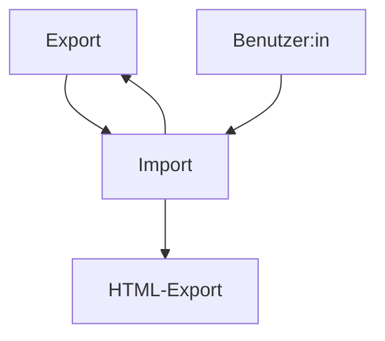
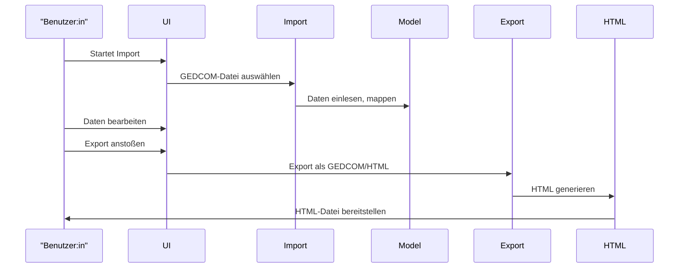

# Architektur-Dokumentation (arc42) – Genealogy Data Management (.NET 10)

## 1. Einleitung und Ziele

Dieses Projekt dient der Verwaltung genealogischer Daten mit Fokus auf Import und Export von GEDCOM-Dateien. Es unterstützt komplexe Familienstrukturen, bietet eine WPF-basierte Benutzeroberfläche und ermöglicht den Export in HTML zur Weitergabe und Präsentation.

**Zielgruppen:**  
- Entwickler:innen  
- Anwender:innen mit genealogischem Interesse  
- Integratoren von genealogischer Software

---

## 2. Randbedingungen

- **Technologie:** .NET 10, WPF, C#
- **Datenformate:** GEDCOM, XML, HTML/CSS
- **Plattform:** Windows Desktop
- **Standards:** .editorconfig, Namenskonventionen, arc42

---

## 3. Kontextabgrenzung


---

## 4. Lösungsstrategie

- **Trennung von Import/Export und Datenmodell**
- **Mapping von GEDCOM-IDs auf interne GUIDs**
- **WPF für UI und Datenbindung**
- **HTML-Export mit CSS für Präsentation**
- **Strikte Einhaltung von Coding-Standards**

---

## 5. Bausteinsicht

- **GedcomImport/GedcomExport:**  
  Importiert/Exportiert GEDCOM, wandelt in XML um, verarbeitet Adoption/Foster-Tags.
- **Modelle:**  
  `Person`, `Family`, `Source`, `Repository` – mit Beziehungen.
- **UI:**  
  WPF-Controls für Bearbeitung, Export, Verwaltung.
- **HTML-Export:**  
  Generiert HTML mit Tabellen, Metadaten, CSS.

---

## 6. Laufzeitsicht


---

## 7. Verteilungssicht

- **Single-User Desktop-Anwendung**
- **Keine verteilten Komponenten**

---

## 8. Querschnittliche Konzepte

- **Namenskonventionen:**  
  Siehe `.editorconfig` (z.B. `_camelCase` für Felder)
- **Fehlerbehandlung:**  
  Null-Propagation, Pattern Matching
- **Datenbindung:**  
  WPF-Standards
- **Erweiterbarkeit:**  
  Neue GEDCOM-Tags via XML-Mapping

---

## 9. Architekturentscheidungen

- **.NET 10** für moderne Features und Langlebigkeit
- **WPF** für UI wegen Datenbindung und Desktop-Fokus
- **GEDCOM-zu-XML-Mapping** für Flexibilität
- **HTML-Export** für plattformunabhängige Weitergabe

---

## 10. Qualitätsanforderungen

- **Wartbarkeit:**  
  Strikte Coding-Standards, modulare Struktur
- **Benutzbarkeit:**  
  Intuitive WPF-Oberfläche
- **Erweiterbarkeit:**  
  Leichtes Hinzufügen neuer GEDCOM-Features

---

## 11. Risiken und technische Schulden

- **GEDCOM-Standardabweichungen** (z.B. Adoption/Foster)
- **Komplexität bei Datenbeziehungen**
- **UI-Tests und Barrierefreiheit**

---

## Migration Notes

- Scope: Migration of the `family.show` project from .NET 8 to .NET 10 as part of the repository upgrade.

- SDK / global.json:
  - Exact SDK version: **10.0.100** (pin this version in `global.json` for reproducible builds).
  - Example `global.json`:

```json
{
  "sdk": {
    "version": "10.0.100"
  }
}
```

  - Review and update `global.json` if present to reference the desired .NET 10 SDK version.
  - Developers should validate installed SDKs with `dotnet --list-sdks` or `dotnet --info` and use a consistent SDK.

- Project files (.csproj):
  - Set `TargetFramework` to `net10.0` (e.g. `<TargetFramework>net10.0</TargetFramework>`).
  - Ensure correct SDK attributes (e.g. `Microsoft.NET.Sdk.WindowsDesktop`) and `<UseWPF>true</UseWPF>`.
  - Migrate legacy `packages.config` to `PackageReference` if needed.

- NuGet dependencies:
  - Update NuGet packages to versions that support .NET 10.
  - Pay special attention to `Newtonsoft.Json`, `Microsoft.Data.SqlClient`, and WPF helper packages.
  - Read breaking-change notes for major packages and apply required code changes.

- WPF compatibility:
  - Test XAML bindings, resources, and styles with the updated build.
  - Check for deprecated APIs (Dispatcher calls, VisualTreeHelper changes) and third-party control compatibility.

- APIs & code changes:
  - Replace deprecated or removed APIs with modern equivalents where necessary.
  - Watch for changes in serialization APIs, `System.*` namespaces, `HttpClient`, `System.Text.Json`, and threading/task behavior.

- Build / CI checklist:
  1. Update `global.json` (if used) and pin SDK to 10.0.100.
  2. Verify or update CI build images to support .NET 10 or install the SDK explicitly.
  3. Automate `dotnet restore`, `dotnet build`, and `dotnet test`.
  4. Review signing/code-signing steps if applicable.
  5. Verify artifact publishing (e.g., MSIX / installer updates).

- Tests & validation:
  - Run unit and integration tests locally and in CI.
  - Execute UI tests (manual or automated) for critical paths: import, family display, export (GEDCOM + HTML).
  - Ensure regression tests for HTML export output (rendering, CSS) are in place.

- Rollout & compatibility:
  - Maintain backward compatibility for exported GEDCOM/HTML files where possible.
  - Review publishing targets and runtime identifiers when producing installers or standalone builds.

- Fallback / rollback:
  - Use a feature branch (`upgrade/net10-family-show`) and create a PR with tests for review.
  - Prepare a revert/rollback plan (rollback branch, hotfix plan) for critical failures.

- Other notes:
  - Update documentation (`README`, `ARCHITECTURE.md`) to record migration changes.
  - Add developer notes about known behavior changes to `docs/migration-notes.md`.

---

## Action items (Must pass before merge)

- [ ] global.json pinned to 10.0.100 and committed
- [ ] CI pipeline updated and green (build + tests)
- [ ] All unit tests passing
- [ ] HTML export regression test passing
- [ ] Manual UI smoke test for import/display/export completed and recorded in PR
- [ ] PR includes migration notes and risk items

---

## Developer onboarding / Getting started (local)

1. Install .NET 10 SDK 10.0.100: https://dotnet.microsoft.com/download (or use your package manager).
2. Verify SDK: `dotnet --info` (expect 10.0.100 installed).
3. Restore packages: `dotnet restore` (solution root).
4. Build: `dotnet build -c Release`.
5. Run unit tests: `dotnet test`.
6. Launch WPF app for manual UI checks (run from Visual Studio or `dotnet run` in project folder when supported).
7. Verify import/export flows and HTML output.

---

## CI example (GitHub Actions)

```yaml
name: .NET 10 CI
on: [push, pull_request]
jobs:
  build:
    runs-on: windows-latest
    steps:
      - uses: actions/checkout@v4
      - name: Setup .NET SDK
        uses: actions/setup-dotnet@v3
        with:
          dotnet-version: '10.0.100'
      - name: Restore
        run: dotnet restore
      - name: Build
        run: dotnet build --no-restore -c Release
      - name: Test
        run: dotnet test --no-build -c Release --verbosity normal
```

Notes: If hosted image does not include SDK, `actions/setup-dotnet` will install it. Consider caching NuGet packages for speed.

---

## Recommended next steps

- Create `docs/migration-notes.md` with step-by-step commands and troubleshooting tips referenced by this document.
- Add a short CI badge and update README to show migration status.
- Assign a migration owner/contact and include in PR descriptions.

---

## 12. Glossar

- **GEDCOM:** Standardformat für genealogische Daten
- **WPF:** Windows Presentation Foundation
- **GUID:** Globally Unique Identifier

---

*Author:* Jörg Hoffmann 
*Stand: 2026-05-31*
